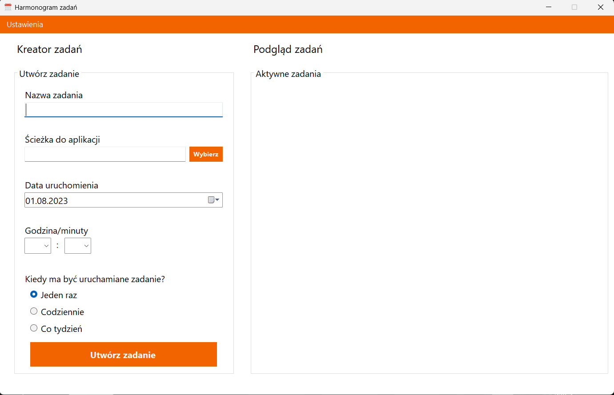
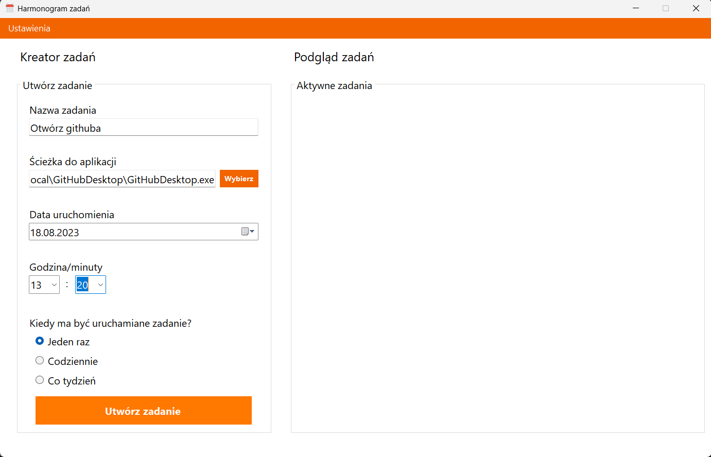
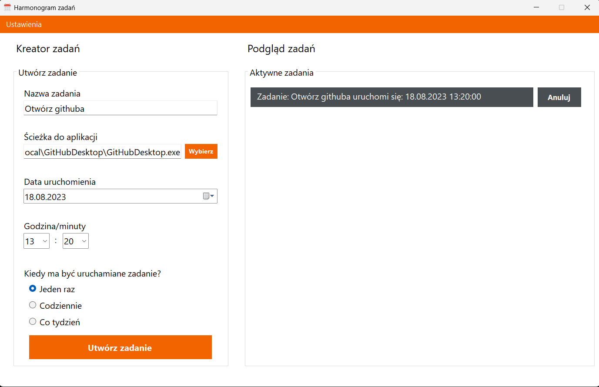
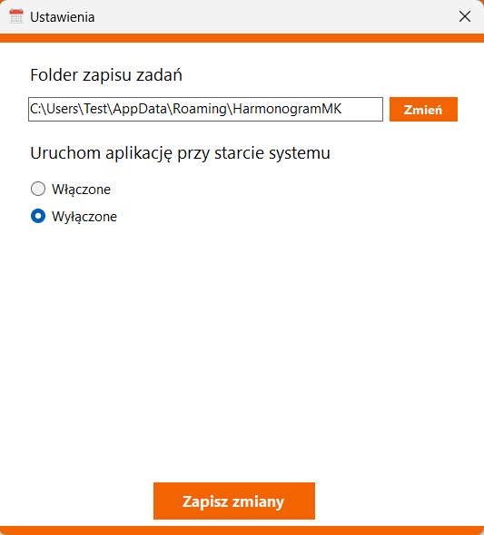

# HarmonogramMK

HarmonogramMK to prosta aplikacja do planowania zadań. Umożliwia ona tworzenie zadań uruchamiających inne aplikacje o wybranej porze. 
Zadania wykonywane są automatycznie o określonym przez użytkownika czasie. Aplikacja zapewnia łatwy sposób dodawania zadań, 
które będą wykonane w określonych godzinach, dniach lub co określony czas np. codziennie lub co tydzień.

## Funkcje

###  Kreator zadań
- **Nazwa zadania**: W tym polu użytkownik wprowadza nazwę zadania (max. 14 znaków).
- **Ścieżka do aplikacji**: W tym polu użytkownik może ręcznie wprowadzić ścieżkę do aplikacji, która po określonym czasie 
powinna się uruchomić lub może wybrać ścieżkę używając eksploratora plików klikając w przycisk *Wybierz*.
- **Data uruchomienia**: W tym polu użytkownik używając kontrolki z ikoną kalendarza możew wybrać datę wykonania zadania.
- **Godzina/minuty**: Użytkownik może wprowadzić tu porę(godziny i minuty) wykonania zadania.
- **Kiedy ma być uruchamiane zadanie?**: Użytkownik może wybrać tu typ wykonywania zadania.
- **Rodzaje Zadań**: Dostępne zadania to **Jednorazowe** - zadanie wykona się jeden raz po czym zostanie usunięte, 
 jeżeli aplikacja nie jest włączona o porze o której zadanie powinno się wykonać zadanie pozostanie w liście aktywnych zadań (ze zmienionym kolorem i komunikatem), 
 aby użytkownik wiedział, że takie zadanie się nie wykonało. Użytkownik może je usunąć.
**Codzienne** zadanie będzie wykonywać się codziennie o tej samej porze dopóki użytkownik go nie anuluje.
**Cotygodniowe** zadanie będzie wykonywać się co tydzień o tej samej porze dopóki użytkownik go nie anuluje.
- **Utwórz zadanie**: przycisk umożliwia dodanie nowego zadania.
- 

###  Podgląd zadań
- **Aktywne zadania**: W tym oknie widoczne są wszystkie aktywne zadania oraz takie, które 
nie mogły wykonać się ze względu na niedostępność aplikacji w czasie w którym powinny się uruchomić. 
Użytkownik ma tu również możliwość anulowania zadania lub usunięcia(nie wykonane zadania).

###  Inne funkcjonalności
- **Automatyczny zapis**: Aplikacja automatycznie zapisuje zadania, nawet po zamknięciu programu.
- **Ustawienia**: Przycisk umożliwia przejście do okna wyboru/zmiany ustawień aplikacji.
Użytkownik może tu zmienić folder zapisu zadań lub włączyć/wyłączyć możliwość uruchamiania aplikacji wraz ze startem systemu.
- **Minimalizacja/praca w tle**: po kliknięciu minimalizuj aplikacja minimalizuje się, a jej ikona pojawia się w zasobniku systemowym(system tray).
Podwójne kliknięcie na ikonę pozwala otworzyć okno aplikacji z powrotem.

## Jak pobrać?

1. **Pobranie**: Pobierz najnowszą wersję HarmonogramMK z [Releases](https://github.com/Makolojka/TaskSchedulerForm/releases/tag/v.1.0.0).
2. **Instalacja**: Wystarczy uruchomić pobrany plik wykonywalny, aby otworzyć aplikację.

## Użycie

- **Dodawanie Zadania**: Wprowadź nazwę zdarzenia, wybierz docelową aplikację, wybierz rodzaj zdarzenia (Jednorazowe, Dziennie, Tygodniowo) i ustaw datę oraz godzinę. Kliknij przycisk "Utwórz zadanie".
- **Usuwanie zadania**: Kliknij przycisk "Usuń" obok zadania, aby je usunąć z listy.
- **Anulowanie zadania**: Kliknij przycisk "Anuluj" obok zadania, aby zatrzymać jego wykonanie i usunąć z listy.
- **Powiadomienia**: Aplikacja wyświetli powiadomienie, jeżeli otwarcie aplikacji nie powiedzie się, jeżeli się powiedzie aplikacja zostanie uruchomiona bez powiadamiania o tym użytkownika.

## Uwaga!
Aplikację najlepiej uruchamiać jako administrator, gdyż brak praw do niektórych aplikacji lub folderów może spowodować, że aplikacje się nie uruchomią, aplikacja została zabezpieczona i użytkownik powinien otrzymać stosowne komunikaty o braku praw do folderów lub aplikacji.

## Wnioski oraz rzeczy do zmiany
Co można by dodać:
- więcej parametrów, zwiększenie elastyczności aplikacji poprzez dodanie kolejnych parametrów obsługujących zdarzenia.
- nowe typy zdarzeń, póki co aplikacja pozwala jedynie na otwarcie programu/procesu w określonym czasie. Można by dodać nowe typy zdarzeń/wyzwalaczy np. wysłanie wiadomości.
- zastosować bazę danych oraz języka SQL do obsługi zapisu i odczytu danych zadań, co mogłoby zapewnić lepszą spójność, ochronę i zarządzanie. Póki co realizowane jest to w bardzo prymitywny sposób zapisu danych do pliku JSON, działającego jak prosta nierelacyjna, pseudo baza danych.
- osobne okna aplikacji dla każdej funkcjonalności tj. tworzenie nowych zadań, podgląd aktywnych zadań. Jedynie zmiana opcji aplikacji działa w ten sposób, chociaż jest to modal, lepszym rozwiązaniem byłoby zastosowanie user control, a więc osobnych okien aplikacji które zmieniałby jedynie zawartość/widok aplikacji, a nie powodowałby wyświetlanie kolejnych okien. Zwiększyłoby to czytelność i wygodę użytkowania.

Co należałoby poprawić:
- zmienić model aplikacji na taki używający user control, co zwiększyłoby re-używalność poszczególnych komponentów, można by podzielić aplikację na osobne okna(user control), które jasno i czytelnie segregowałby różne funkcjonalności. Np. rozdzielić okna tworzenia nowego zdania oraz aktywnych zadań.
- w aktualnej wersji można by jasno rozdzielić obsługę UI i zachowanie kontrolek od logiki, co dużo lepiej spełniałoby założenia programowania obiektowego – każda klasa powinna mieć jedną odpowiedzialność, być odpowiedzialna za jedną funkcjonalność. Zwiększyłoby to czytelność kodu oraz jego jakość. W tym momencie elementy logiki, głównie tworzenie nowych zadań realizowane jest w klasie głównej Form1, w której lepiej byłoby zostawić jedynie obsługę wyglądu i odseparować ją od logiki (tworzenie nowych zadań).
- stworzyć osobną klasę do obsługi tworzenia i zarządzania zadaniami.
- rzeczą którą należałoby zmienić jest również UI, które w tym momencie jest nieco ograniczone. Statyczne rozwiązania można by zamienić na bardziej responsywne, które umożliwiłyby zmianę rozmiaru okna aplikacji bez obawy o problemy ze skalowaniem / układaniem się elementów.
- należałoby pomyśleć nad scaleniem klas TaskInfo oraz TaskControl jako że realizują one podobne odpowiedzialności
- można by pomyśleć nad zmianą rozróżniania typu zadań, póki co realizowane jest to za pomocą typu wyliczeniowego TaskType, jednak można by pomyśleć nad zastosowaniem dziedziczenia, i nowy typ rozszerzałby typ bazowy, co lepiej spełnia zasady programowania obiektowego.
- przydałoby się poprawić kod m.in. w metodzie TaskTimer_Elapsed() ze względu na powtórzenia kodu, chodzi o usuwanie zadań i timerów z pamięci. Należałoby utworzyć uniwersalną metodę do usuwania zadań.
- metoda GetScheduledTimeFromLabelText() ze względu na pewne uproszczenia i brak pola zawierającego już sparsowaną datę, została utworzona w początkowej fazie projektu w celu parsowania daty z tekstu z kontrolki Label. Metodę tą należałoby usunąć, a dane pobierać z pola TargetDateTime należącego do obiektu TaskInfo, który z kolei jest przechowywany w TaskControls.
- w metodzie changePathBtn_Click(), używającej OpenFileDialog, „wbudowanej” klasy, która wyświetla standardowe okno dialogowe z monitem użytkownika o otwarcie pliku obserwowany jest nietypowy, 2-krotny, jednorazowy skok pamięci. Potencjalny wyciek pamięci lub niepoprawne usuwanie z pamięci po wybraniu folderu.

